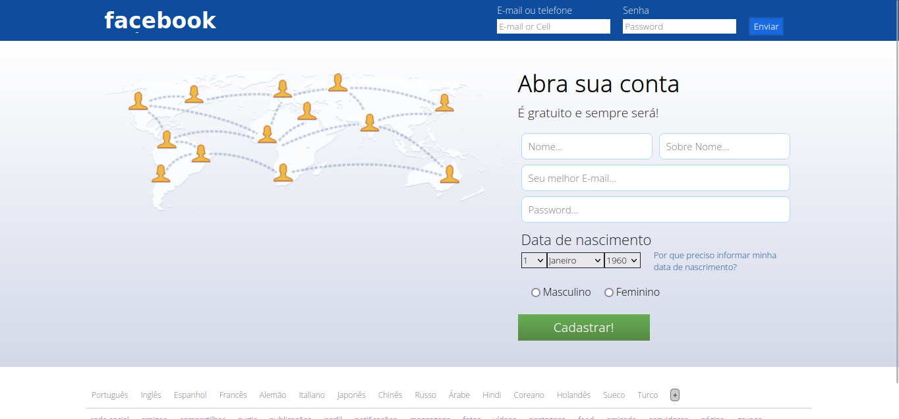
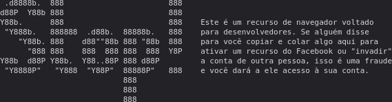

# facebook_login_antigo
Tela de login antiga do Facebook

## Pré visu:


### HTML/PHP:
```
    <!DOCTYPE html>
<html lang="pt-BR">
<head>
    <meta charset="UTF-8">
    <meta name="viewport" content="width=device-width, initial-scale=1.0">
    <title>Login facebook</title>
    <link rel="stylesheet" href="css/style.css">
    <link rel="preconnect" href="https://fonts.googleapis.com">
<link rel="preconnect" href="https://fonts.gstatic.com" crossorigin>
<link href="https://fonts.googleapis.com/css2?family=Fira+Sans&family=Open+Sans:wght@300&display=swap" rel="stylesheet">
<link rel="stylesheet" href="https://cdn.jsdelivr.net/npm/bootstrap-icons@1.10.5/font/bootstrap-icons.css">
</head>
<body>
    <header>
        <div class="center1">
            <div class="logo">
                <h2>facebook</h2>
            </div><!--LOGO-->
            <form method="post" class="form-login">
                <div class="form-element">
                    <p>E-mail ou telefone</p>
                <input type="email" name="email" placeholder="E-mail or Cell" id="email">
                </div><!--FORM-ELEMENT-->
                <div class="form-element">
                    <p>Senha</p>
                <input type="password" placeholder="Password" name="password" id="password">
                </div><!--FORM-ELEMENT-->
                <div class="form-element">
                <input type="submit" name="enviar" value="Enviar" id="enviar">
                </div><!--FORM-ELEMENT-->
            </form><!--FORM-LOGIN-->
            <div class="clear"></div>
        </div><!--CENTER-->
    </header>

    <section class="main">
        <div class="center1">
            <div class="img-pessoas">
                
            </div><!--IMG-PESSOAS-->
            <div class="abrir-conta">
                <h2>Abra sua conta</h2>
            </p>
            <p>
                <h3>É gratuito e sempre será!</h3>
                <form class="criar-conta" action="">
                    <div class="w50">
                        <input type="text" name="fnome" id="fnome" placeholder="Nome...">
                    </div><!--w50-->

                    <div class="w50">
                        <input type="text" name="fsobre" id="fsobre" placeholder="Sobre Nome...">
                    </div><!--w50-->

                    <div class="w100">
                        <input type="email" name="femail" id="femail" placeholder="Seu melhor E-mail...">
                    </div><!--w100-->

                    <div class="w100">
                        <input type="password" name="fsenha" id="fsenha" placeholder="Password...">
                    </div><!--w100-->

                    <div class="w100">

                    </div><!--w100-->

                    <div class="w100">
                        <h2>Data de nascimento</h2>
                        <select name="" id="" class="nascimento">
                            <?php
                                for($dia_mes = 1;$dia_mes <= 31;$dia_mes++){
                            ?>
                            <option value="<?php echo $dia_mes; ?>"><?php echo $dia_mes; ?></option>
                            <?php } ?>
                        </select>
                        <select name="" id="" class="nascimento">
                            <?php 
                            $meses = array("Janeiro", "Fevereiro", "Março", "Abril", "Maio", "Junho", "Julho", "Agosto", "Setembro", "Outubro", "Novembro", "Dezembro");

                            foreach($meses as $mes){

                            ?>
                            <option value="<?php echo $mes ?>"><?php echo $mes ?></option>
                            <?php } ?>
                        </select>
                        <select name="" id="" class="nascimento esp">
                        <?php
                                for($ano = 1960;$ano <= 2023;$ano++){
                            ?>
                            <option value="<?php echo $ano; ?>"><?php echo $ano; ?></option>
                            <?php } ?>
                        </select>
                        <p>Por que preciso informar minha data de nascrimento?</p>
                        <div class="clear"></div>

                        <div class="w100">
                                    <div class="input-radio">
                                    <input type="radio" name="sexo" value="msaculino" id="m">
                                    <label for="m">Masculino</label>
                                    </div><!--input-radio-->
                                    <div class="input-radio">
                                    <input type="radio" name="sexo" value="femi" id="f">
                                    <label for="f">Feminino</label>
                                    </div><!--input-radio-->
                                    <div class="clear"></div>
                        </div><!--w100-->

                    </div><!--w100-->
                    
                    <input type="submit" value="Cadastrar!" name="acao">
                    <div class="clear"></div>
                </form><!--CRIAR-CONTA-->
            </div><!--abrir-conta-->
            <div class="clear"></div>
        </div><!--CENTER-->
    </section><!--MAIN-->

    <section class="linguas">
        <div class="center1">
            <?php $ling = array("Português","Inglês","Espanhol","Francês","Alemão","Italiano","Japonês","Chinês","Russo","Árabe","Hindi","Coreano","Holandês","Sueco","Turco"
); 
            foreach($ling as $lingv){
?>
            <a href="#" class="sl-lin"><?php echo $lingv ?></a>
            <?php } ?>
            <i class="bi bi-plus edd"></i>
        </div><!--center-->
        <div class="center">
            <?php $palavrasFacebook = array(
    "rede social", "amigos", "compartilhar", "curtir", "publicações",
    "perfil", "notificações", "mensagens", "fotos", "vídeos",
    "postagens", "feed", "amizade", "seguidores", "página",
    "grupos", "evento", "marcar", "timeline", "comentários",
    "emojis", "reagir", "privacidade", "configurações", "perfil público",
    "bloquear"
);
            foreach($palavrasFacebook as $txt){ ?>
            <a href="#" type="teste"><?php print $txt ?></a>
        <?php } ?> 
        </div><!--center-->
    </section><!--linguas-->
    <script src="js/script.js"></script>
</body>
</html>
```

### CSS:
```
    *{
    padding: 0;
    margin: 0;
    box-sizing: border-box;
    font-family: 'Open Sans', sans-serif;
}
body,html{
    height: 100%;
}
a{
    text-decoration: none;
}
/*=================CLEAR=====================*/
.clear{clear: both;}
/*=================FONTS=====================*/
    /*
    font-family: 'Fira Sans', sans-serif;
    font-family: 'Open Sans', sans-serif;
    */
/*=================HEADER====================*/
.center1{
    max-width: 1100px;
    padding: 0 2%;
    margin: 0 auto;
}

header{
    background-color: #0e4c9e;
    padding: 8px 0;
}
.logo{
    float: left;
    color: #FFFFFF;
    margin-top: 5px;
}
.logo h2{
    font-size: 33px;
    font-weight: bold;
     font-family: 'Helvetica Neue', sans-serif;
}
form.form-login{
    float: right;
}
.form-login .form-element{
    display: inline-block;
    margin-right: 15px;
}
 .form-element p{
    color: #FFFFFF;
    font-size: 14px;
}
.form-element input[type="email"],
.form-element input[type="password"]{
    margin-top: 4px;
    border: none;
    height: 22px;
    padding-left: 3px;
}
.form-element input[type="submit"]{
    cursor: pointer;
    border: 2px solid #215ab2;
    background-color: #1969e5;
    color: #FFFFFF;
    padding: 3px 5px;
    transition: 0.3s;
    font-weight: bold;
}
.form-element input[type="submit"]:hover{
    background-color: #215ab2;
}
section.main{
    background-image: linear-gradient(#FFFFFF, #D3D8E8);
    padding: 40px 0;
}
.img-pessoas{
    float: left;
    width: 60%;
}
.img-pessoas img{
    max-width: 100%;
}
.abrir-conta{
    width: 40%;
    float: left;
}
.abrir-conta h2{
    color: #000000;
    font-size: 35px;
}
.abrir-conta h3{
    font-size: 19px;
    color: rgb(30,30,30);
    margin-top: 8px;
    font-weight: normal;
}
form.criar-conta{
    margin-top: 10px;
}
.w50{
    width: 50%;
    padding: 0 5px;
    float: left;
}
.w100{
    width: 100%;
    padding: 0 5px;
    float: left;
}
form.criar-conta input{
    width: 100%;
    margin-top: 8px;
}
form.criar-conta input[type="email"],
form.criar-conta input[type="text"],
form.criar-conta input[type="password"]{
    height: 40px;
    border: 1px solid #a5dcff;
    padding-left: 10px;
    font-size: 15px;
    border-radius: 8px;
}
form.criar-conta input[type="submit"]{
    height: 40px;
    background: linear-gradient(#67ae55,#558843);
    color: #FFFFFF;
    cursor: pointer;
    border: none;
    max-width: 200px;
    font-size: 19px;
    font-weight: bold;
}
form .w100 h2{
    margin-top: 10px;
    color: #1d2129;
    font-size: 22px; 
    font-weight: normal;  
}
form select{
    border-radius: 0;
    border: 1px solid #1d2129;
    padding: 2px;
    cursor: pointer;
}
form select.nascimento{
    float: left;
    margin-top: 5px;
}
.criar-conta p{
    color: #0e4c9e;
    cursor: pointer;
    transition: 0.3s;
    font-size: 13px;
}
.criar-conta p:hover{
    text-decoration: underline;
    color: rgb(67, 48, 170);
}
.esp{
    margin-right: 20px;
}
.input-radio{
    float: left;
    margin: 15px 10px;    
}
.input-radio h2{
    display: inline-block;
}
.input-radio input[type="radio"], label{
    width: auto !important;
    display: inline-block;
    cursor: pointer;
}
section.linguas{
    padding: 30px 0;
}
section.linguas a{
    color: #365899;
    font-size: 12px;
    padding-right: 15px;
}
section.linguas a.sl-lin{
    color: #737373;
}
section.linguas .center1{
    padding-left: 8px;
    padding-right: 8px;
    padding-bottom: 10px;
    border-bottom: 1px solid #CCCCCC;
}
.edd{
    font-size: 12px;
    cursor: pointer;
    background-color: #CCCCCC;
    border-radius: 5px;
    border: 1px solid #737373;
}
.center{
    max-width: 1100px;
    padding: 0 2%;
    margin-top: 5px;
    margin-left: 112px;
}
@media screen and (max-width: 768px) {
    .logo{
        float: none;
        width: 100%;
        text-align: center;
    }
    form.form-login{
        margin-top: 17px;
        float: none;
        width: 100%;
        text-align: center;
    }
    .form-login .form-element{
        display: block;
        margin: 10px 0;
    }
     .form-element p{
        color: #FFFFFF;
        font-size: 14px;
    }
    .form-element input[type="email"],
    .form-element input[type="password"]{
        margin-top: 4px;
        border: none;
        height: 22px;
        padding-left: 3px;
        width: 100%;
        max-width: 320px;
    }
    .img-pessoas{
        display: none;
    }
    .abrir-conta{
        width: 100%;
    }
}
```

## JS -> PARA MENSAGEM CONSOLE

#### Pré visu:


### JS:
```
    console.log(`


                                            
.d8888b.  888                       888    
d88P  Y88b 888                       888    
Y88b.      888                       888    Este é um recurso de navegador voltado 
"Y888b.   888888  .d88b.  88888b.   888    para desenvolvedores. Se alguém disse 
   "Y88b. 888    d88""88b 888 "88b  888    para você copiar e colar algo aqui para 
     "888 888    888  888 888  888  Y8P    ativar um recurso do Facebook ou "invadir" 
Y88b  d88P Y88b.  Y88..88P 888 d88P         a conta de outra pessoa, isso é uma fraude 
"Y8888P"   "Y888  "Y88P"  88888P"   888    e você dará a ele acesso à sua conta.
                          888              
                          888              
                          888              

Consulte https://www.facebook.com/selfxss para obter mais informações.

By DevSozinho

`)
```

## Nota:
```
    já está responsivo. Site criado com o objetivo de estudo.
```